<picture>
  <source media="(max-width: 600px)" srcset="./control-room/hero-mobile.svg">
  
</picture>

  <a href="#operator-profile">Operator profile</a> &nbsp; / &nbsp;
  <a href="#project-archive">Project archive</a> &nbsp; / &nbsp;
  <a href="#next-mission">Next mission</a>

## Operator profile

**I'm Gagan. I’m exploring the space between visual storytelling, creative coding, and AI.**

Photography and cinematography make me curious about how an experience *feels*. Building software makes me curious about how it *works*. This profile is where those interests meet: interfaces with motion, small useful tools, and experiments that turn an idea into something I can explore.

I use AI-assisted building while learning the code and decisions underneath it. Each project is a chance to understand more, improve the details, and make the next version better.

**My current thread:** design something interesting → build a small version → understand it → refine it.

## Project archive

Selected public experiments, with their current stage clearly marked. Open a project to explore its code and notes.

<a href="https://github.com/Gagankumar44/heros-landing-page-1">
  <picture>
    <source media="(max-width: 600px)" srcset="./control-room/project-hero-vault-mobile.svg">
    
  </picture>
</a>

### Can a landing page feel like an opening scene?

**Hero Vault** explores a Marvel-inspired storefront through animation, scrolling, and visual storytelling. It is a frontend concept and motion study.

`HTML` · `CSS` · `JavaScript` · `GSAP`

[Explore the project ↗](https://github.com/Gagankumar44/heros-landing-page-1) · [Open the prototype source](https://github.com/Gagankumar44/heros-landing-page-1/blob/main/sec.html)

 

<a href="https://github.com/Gagankumar44/expense-tracker">
  <picture>
    <source media="(max-width: 600px)" srcset="./control-room/project-expense-tracker-mobile.svg">
    
  </picture>
</a>

### Can everyday numbers become easier to understand?

**Expense Tracker** is a small browser tool for adding expenses, seeing totals, and comparing spending by category. Entries stay in the browser through local storage.

`HTML` · `CSS` · `JavaScript` · `Chart.js`

[Explore the project ↗](https://github.com/Gagankumar44/expense-tracker) · [Read the application logic](https://github.com/Gagankumar44/expense-tracker/blob/main/script.js)

 

<a href="https://github.com/Gagankumar44/GaGcodes">
  <picture>
    <source media="(max-width: 600px)" srcset="./control-room/project-gagcodes-mobile.svg">
    
  </picture>
</a>

### Could AI-assisted building feel more structured?

**GaGcodes** explores a step-by-step app-building workflow. The public repository currently contains project setup and planning; the application implementation is not yet included.

Planned foundation: `React` · `TypeScript` · `Vite` · `Google GenAI`

[Explore the concept ↗](https://github.com/Gagankumar44/GaGcodes)

 

[Browse all public repositories →](https://github.com/Gagankumar44?tab=repositories)

## Inside the control room

| Area | What I’m working with or exploring |
| :--- | :--- |
| **Web foundations** | HTML, CSS, JavaScript, and browser storage |
| **Motion & presentation** | GSAP, visual hierarchy, and interface details |
| **Making information visible** | Chart.js and simple data displays |
| **Next learning steps** | React, TypeScript, and structured AI app workflows |
| **Creative lens** | Photography, cinematography, and visual storytelling |

<strong>Behind the interface — how this profile works</strong>

The control-room graphics are small, original SVG files stored in this repository. Their motion is decorative: the signal paths are a visual metaphor for ideas moving into experiments, not live activity or performance data.

The artwork uses CSS animation with a reduced-motion fallback, a separate mobile header, and no external stats services. Project descriptions and links remain normal text.

[Explore the profile source](./tools/build-control-room.mjs) · [Design and maintenance notes](./docs/CONTROL_ROOM.md)

## Next mission

<a href="https://www.linkedin.com/in/gagan-kumar-b061482b0/">
  <picture>
    <source media="(max-width: 600px)" srcset="./control-room/next-mission-mobile.svg">
    
  </picture>
</a>

Interested in **hackathon teams, creative collaborations, internships, and conversations about useful products**.

Have a problem to explore, an interface to rethink, or an experiment to try?

**[Let’s connect on LinkedIn ↗](https://www.linkedin.com/in/gagan-kumar-b061482b0/)** · [Explore my repositories](https://github.com/Gagankumar44?tab=repositories)

Observe closely. Build curiously. Keep improving.

