<picture>
  <source media="(max-width: 600px) and (prefers-color-scheme: light)" srcset="./ai-lab/curiosity-mobile-light.svg">
  <source media="(max-width: 600px)" srcset="./ai-lab/curiosity-mobile.svg">
  <source media="(prefers-color-scheme: light)" srcset="./ai-lab/curiosity-light.svg">
  
</picture>

  <a href="#about-me">About</a> &nbsp; · &nbsp;
  <a href="#my-foundations">Knowledge</a> &nbsp; · &nbsp;
  <a href="#projects">Projects</a> &nbsp; · &nbsp;
  <a href="https://www.linkedin.com/in/gagan-kumar-b061482b0/">LinkedIn ↗</a>

## About me

**I’m Gagan — curious about AI, how it works, how it learns, and what we can build with it.**

I research AI topics, explore new ideas, and connect them with my programming and computer-systems knowledge. I know Python and Java, and I’m continuing to strengthen my understanding through learning and practical experiments.

**Currently learning:** AI models, model training, and AI automation workflows.

<picture>
  <source media="(max-width: 600px) and (prefers-color-scheme: light)" srcset="./ai-lab/learning-loop-mobile-light.svg">
  <source media="(max-width: 600px)" srcset="./ai-lab/learning-loop-mobile.svg">
  <source media="(prefers-color-scheme: light)" srcset="./ai-lab/learning-loop-light.svg">
  
</picture>

## My foundations

| Area | Knowledge & tools |
| :--- | :--- |
| **Programming** | Python · Java |
| **Core concepts** | Data structures & algorithms · Object-oriented programming |
| **Databases & storage** | SQL · PostgreSQL · MongoDB · Relational and NoSQL databases |
| **Computer systems** | Memory management · Processes · Threads |
| **Networking & the web** | TCP/IP · DNS · HTTP/HTTPS |
| **Version control** | Git · GitHub |

I’m also interested in **photography, cinematography, and visual storytelling** — how ideas are presented matters to me.

## Projects

A few of my public experiments:

| Project | In a sentence |
| :--- | :--- |
| [**Hero Vault**](https://github.com/Gagankumar44/heros-landing-page-1) | A landing-page experiment with animation and visual storytelling. |
| [**Expense Tracker**](https://github.com/Gagankumar44/expense-tracker) | A browser tool for tracking spending and viewing category totals. |
| [**GaGcodes**](https://github.com/Gagankumar44/GaGcodes) | An early concept for a structured AI-assisted app-building workflow. |

**[Explore all my repositories →](https://github.com/Gagankumar44?tab=repositories)**

## Let’s connect

I’m interested in **AI conversations, hackathon teams, creative collaborations, and internship opportunities**.

[**Connect on LinkedIn ↗**](https://www.linkedin.com/in/gagan-kumar-b061482b0/)

Follow the question. Test the idea. Keep learning.

